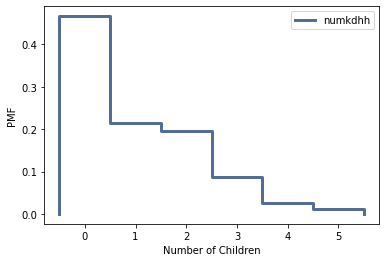
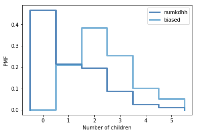

[Think Stats Chapter 3 Exercise 1](http://greenteapress.com/thinkstats2/html/thinkstats2004.html#toc31) (actual vs. biased)

Exercise 3.1 Something like the class size paradox appears if you survey
children and ask how many children are in their family. Families with many
children are more likely to appear in your sample, and families with no children have no chance to be in the sample.Use the NSFG respondent variable NUMKDHH to construct the actual distribution for the number of children under 18 in the household.Now compute the biased distribution we would see if we surveyed the children and asked them how many children under 18 (including themselves) are intheir household.
Plot the actual and biased distributions, and compute their means. As astarting place, you can use chap03ex.ipynb.

I first took the NSFG respondent variable numkdhh and converted it into a Pmf object using the Pmf class from thinkstats2 under the variable name pmf. The PMF function maps each value to its probability creating value:probability pairs. I then used thinkplot to plot Pmf as a step function and labeled each axis.

---

    resp=nsfg.ReadFemResp()
    pmf=thinkstats2.Pmf(resp.numkdhh, label='numkdhh')
    thinkplot.Pmf(pmf)
    thinkplot.Config(xlabel="Number of Children",ylabel="PMF")
    
---

I then used the provided BiasPmf function to compute the biased distribution that put that biased distribution pmf under the variable biased. This takes a copy of pmf, as we will later use the original pmf in comparsion to this new biased pmf, and for each household size,x, we multiply the probability by x, which is the number of children surveyed about their household. 

---
    
    def BiasPmf(pmf, label):
    new_pmf = pmf.Copy(label=label)

    for x, p in pmf.Items():
        new_pmf.Mult(x, x)
        
    new_pmf.Normalize()
    return new_pmf

    biased= BiasPmf(pmf, label='biased')
    
---

I then plotted the unbiased and biased distibutions using PrePlot and Pmfs to show the differences in distribution. This shows a significant skewing to the right in the biased plot when compared to teh numkdhh or unbiased plot. This is due to the lack of data for households with zero children as well as expected PMF increase that comes with a bias distribution. 

---

    thinkplot.PrePlot(2)
    thinkplot.Pmfs([pmf,biased])
    thinkplot.Config(xlabel='Number of Children', ylabel='PMF')
    
---

Lastly I determined the mean values for both the original unbiased pmf of numkdhh and the biased version. As to be expected from the plot the biased mean at 2.404 is more than double to unbiased mean of 1.02 children per household. This shows how significantly missing data or biased distribution can effect the way we interpret a dataset. 

---

    pmf.Mean()
    biased.Mean()
    
---