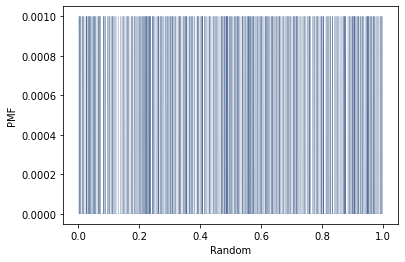
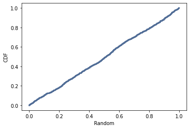

[Think Stats Chapter 4 Exercise 2](http://greenteapress.com/thinkstats2/html/thinkstats2005.html#toc41) (a random distribution)

Exercise 4.2 The numbers generated by random.random are supposed to be uniform between 0 and 1; that is, every value in the range should have the same probability. Generate 1000 numbers from random.random and plot their PMF and CDF. Is the distribution uniform?

I first generated 1000 numbers from numpy.random.random under the variable 'r'. I then converted r into a pmf object and created a PMF plot. This created a graph showing a series of verticle lines, this is due to the fact probability mass functions maps values to their probabilites and using random numbers any number has the same probability of appearing as another. 

---

    r=np.random.random(1000)
    pmf=thinkstats2.Pmf(r)
    thinkplot.Pmf(pmf,linewidth=0.1)
    thinkplot.Config(xlabel="random",ylabel="PMF"

---

I then plotted the CDF of the random numbers (r), which produced a graph with a relatively straight line indicating a uniform distribution. I did a little bit of researching online and while random.random may appear to be randomly generated it is infact deterministic and therefore does not create a list of truly random numbers.

---

    cdf=thinkstats2.Cdf(r)
    thinkplot.Cdf(cdf)
    thinkplot.Config(xlabel='random',ylabel='CDF')
    
---

